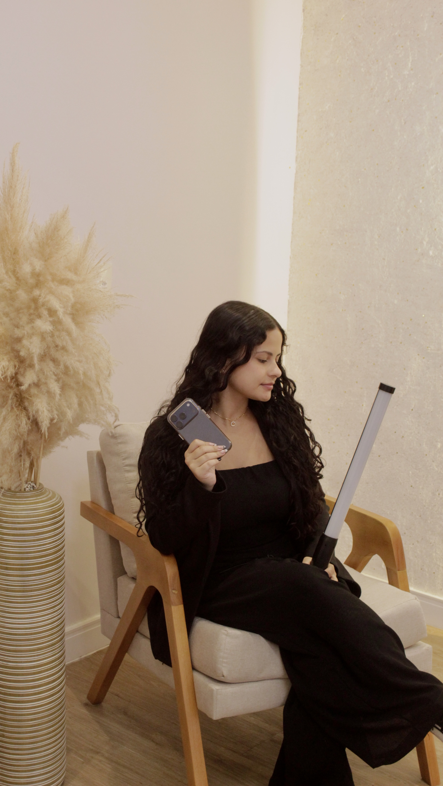

# 🎥 b.inside — Portfólio Profissional & Visual Curation

<p align="center">
  
</p>

## 📌 Sobre o Projeto

Este projeto nasceu com o propósito de tirar do papel o posicionamento digital premium da **b.inside**, marca e agência de marketing de conteúdo comandada pela profissional **Kailane**, baseada em Santa Catarina. 

Desenvolvido de forma personalizada como um presente de apoio profissional para uma grande amiga, o ecossistema foi projetado para ir além de um portfólio comum de estudante: ele funciona como uma ferramenta de conversão de alto impacto para prospecção de clientes e marcas que buscam serviços de **Storymaking, Fotografia, Social Media e Direção Visual**.

---

## 🚀 Funcionalidades & Diferenciais de Experiência

*   **Identidade Adaptativa Dupla (Dual Theme):** O site conta com uma transição fluida entre dois ecossistemas visuais completos:
    *   *Modo White ("Bem Menina"):* Uma abordagem com paleta macia, suave e romântica.
    *   *Modo Black ("Premium"):* Uma atmosfera com tons escuros profundos e contraste cinematográfico de alta sofisticação.
*   **Carrossel de Depoimentos 3D (*Circular Testimonials*):** Integração avançada de um componente premium da *Northstrix*, que rotaciona os feedbacks reais de clientes em perspectiva tridimensional tracionada por física de movimento.
*   **Feedbacks 100% Reais:** Toda a área de depoimentos utiliza transcrições exatas de mensagens de clientes atendidos pela marca (desde ensaios corporativos até casamentos e coberturas de festas infantis), associados a imagens conceituais fictícias representativas de cada nicho.
*   **Foco em Conversão (CTA Magnética):** Copywriting estruturado e gatilhos de fechamento direcionando o cliente diretamente para o canal de atendimento no WhatsApp com mensagens pré-configuradas.

---

## 🛠️ Tecnologias Utilizadas

O projeto foi construído utilizando as melhores práticas do ecossistema moderno de desenvolvimento web focado em performance e fidelidade visual:

*   **[React](https://react.dev/) / [Vite](https://vitejs.dev/)** (ou **Next.js**) — Como biblioteca base para componentização limpa e renderização performática.
*   **[Tailwind CSS](https://tailwindcss.com/)** — Framework utilitário para estilização ágil, garantindo responsividade pixel-perfect e transição de classes eficiente nos modos claro/escuro.
*   **[Framer Motion](https://www.framer.com/motion/)** — Engine de animações robusta utilizada para controlar as transições de opacidade, o efeito de desfoque progressivo na renderização de textos (*blur words*) e o empilhamento dos cards.
*   **React Icons** — Pacote de micro-interações de ícones vetoriais modernos integrados nativamente.
*   **GH-Pages** — Automação de empacotamento (`build`) e deploy contínuo direto no ecossistema do GitHub Pages.

---

## 📐 Técnicas de Engenharia & Arquitetura aplicadas

*   **Visual Curation & Clean Code:** Separação estrita entre a camada de apresentação (componentes UI) e a camada de dados (`src/data/portfolioData.js`), permitindo que novos trabalhos ou depoimentos sejam injetados no futuro sem mexer na estrutura lógica do código.
*   **Mapeamento Cirúrgico Estático:** Gestão otimizada de assets utilizando caminhos relativos na pasta raíz pública (`/images/feedbacks/`), controlando variações de extensões de arquivos (`.jpg` e `.jpeg`) para otimização de cache e carregamento ágil na CDN do GitHub.
*   **Responsividade Dinâmica:** Algoritmo matemático para cálculo de espaçamento de contêineres (`calculateGap`) baseado no *viewport* do usuário, garantindo que o efeito 3D não quebre ou corte em telas de smartphones ou monitores Ultrawide.

---

## 📦 Como rodar o projeto localmente

1. Hospedado na vercel:https://b-inside-porfolio.vercel.app/

2. Clone este repositório:
   ```bash
   git clone [https://github.com/LucasPerezAlves/b.inside-Porfolio.git](https://github.com/LucasPerezAlves/b.inside-Porfolio.git)
